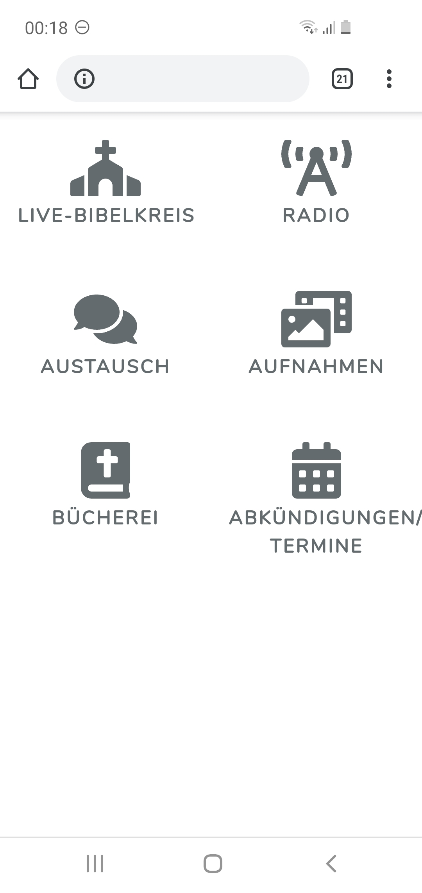
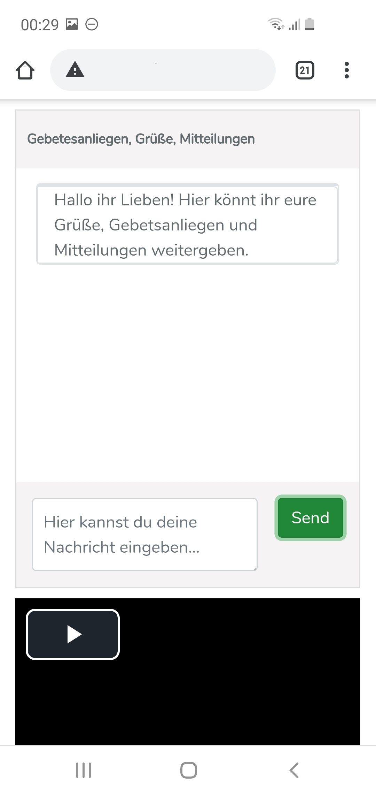
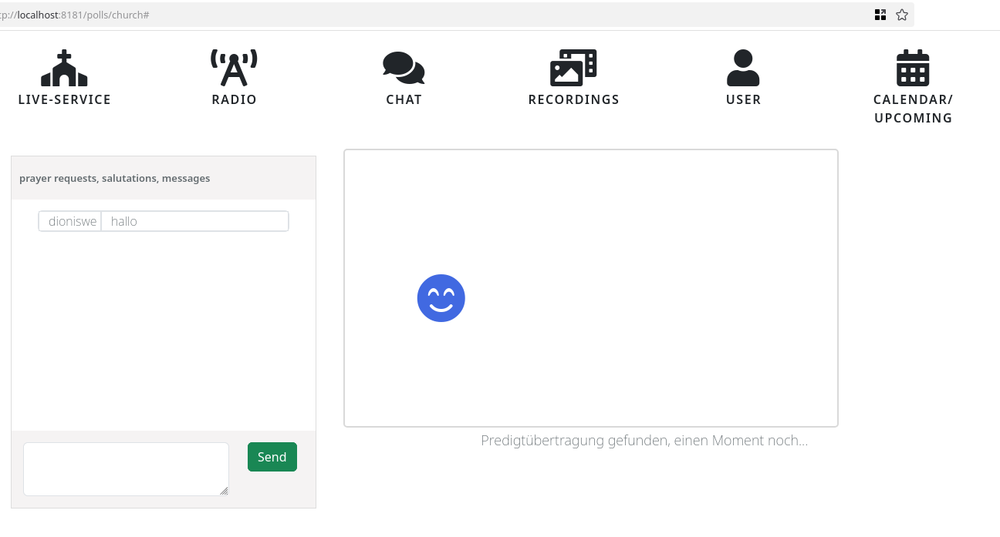
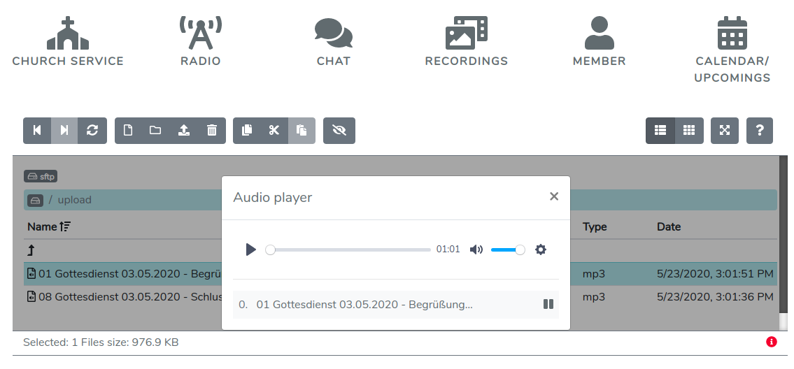

&nbsp; &nbsp; &nbsp; &nbsp; &nbsp; &nbsp;    
&nbsp; &nbsp; &nbsp; &nbsp; &nbsp; &nbsp; 
&nbsp; &nbsp; &nbsp; &nbsp; &nbsp; &nbsp; 
   

## About Chaba

Chaba חבא 
 It is an app supporting churches to use digital capabilities for their gatherings and cooperations and is a response
 to corona-enforced shutdowns of german churches.  in hebrew means to retreat or harden).
 It comprises 

- video streaming church services through common desktop and mobile web-browsers using hls and flashvideo
- audio streaming church services using icecast. Possibility to radio stream 
- Live Chat throughout church service and beyond
- file manager for up- and download of church service recordings and for in-browser playing of its contents
- authentication of church members, administrators and guests
- [Upcoming] Chat-App with User Management and user status management for encouraging communication between church members  
- [Upcoming] Management of "calendar" and "About"-contents of the app 

## Contributing

Thank you for considering contribution to the chaba online church app!   
In brief chaba offers a couple of tools delivering an app to aid churches
in their digital struggle after corona lockdowns. For an initial glance on the used technologies take a look
at the docker-compose.yml.

## Security Vulnerabilities

If you discover a security vulnerability within chaba, please send a notification via my github account.

## License

The Chaba online church app is open-sourced software licensed under the [GPL license](https://opensource.org/licenses/GPL-3.0).

# Installation

### Before you start
chaba occupies the ports 80 (webserver. E.g apache), 8000 (video-streaming), 8008 (webradio), 6001 (websocket) 
by default. 
Stop any other applications running on these ports or configure chaba for using other ports inside chaba .env file.
On common vanilla linux application, you'll probably just want to stop apache: sudo service apache2 stop. 

## STEP 1: prerequisite: install and activate docker, install docker-compose, nodejs, npm and git 
    sudo apt-get install docker-compose docker.io npm nodejs git python3-pip python3-venv python3
    sudo adduser `whoami` docker
    sudo systemctl enable docker

## STEP 2: install chaba python backend and its dependencies. In your installation directory do:
    cd ../backend
    python3 -m venv venv
    source venv/bin/activate
    python -m pip install -r requirements.txt
    python manage.py runserver 8181

## STEP 4 install chaba frontend and its dependencies. In your installation directory do:
    git clone https://github.com/dioniswe/chaba.git chaba
    cd chaba/vite
    npm install
    npm run dev

## STEP 3 configure your chaba application.
 
rename.env.example to .env and modify to contain values for

    ICECAST_SOURCE_PASSWORD to authenticate audio streaming sources
    ICECAST_MOUNT_NAME for the audio streaming url path

    CHABA_ADMIN_USER for generating the chaba admin user (responsible for app contents of startpage and recordings)
    CHABA_ADMIN_PASSWORD  for setting the chaba admin password

    CHABA_CONGREGATION_USER for generating the chaba congregation user (the website user)
    CHABA_CONGREGATION_PASSWORD for setting the chaba congregation password
    
## STEP 4 Bring up the containers finally

    docker-compose up -d

## Step 6 (optional) install google fonts locally
    cd ../vite
    mkdir  static/public/vendor/fonts
    sudo npm install -g google-font-installer
    gfi download Nunito -d public/vendor/fonts  

# Usage

Stream to your 'Radio'-Section using any icecast2 compatible client (i.e Butt). In butt settings fill in your server's domain,
your configured port (default port: 8008) and your configured source authentication key

Stream to your 'Church-Service'-Section using any rtmp-compatible client (i.e OBS). In obs settings fill in your server's domain, 
your configured port (default port: 8000) and your configured streaming key (default key: stream_name)

Chatting works straight

For the recordings management an admin user has been created on laravel initialization who is privileged to upload files.
The congregation user is privileged to download and play files.

  

